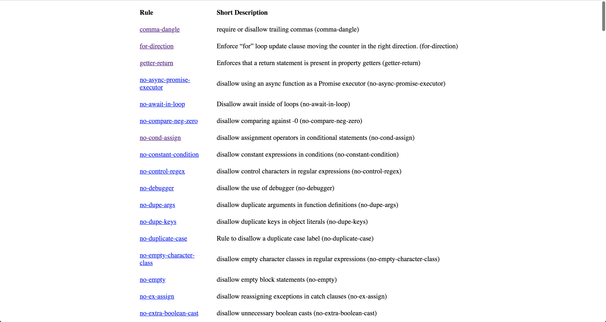

# eslint-static-generator
A generator to create static files based on your eslint configs. Running this tool will create a static JSON file or a static HTML site containing the ESLint rule name, link to the docs page and a short description of the rule.

#### JSON Output
```json
{
  "rules": [{
    "name": "rule-name",
    "link": "https://link-to/rule-name",
    "description": "The Short Description"
  }]
}
```

#### HTML Output


## Get Started
- First, clone this repository locally
- CD into the repository
- Run `npm link`

### Example
```
eslint-static-generator --input <path/to/your/.eslintrc> --output <output/directory> --html
```

This will generate a JSON file and a static HTML site at `<output/directory>`

*Running the cli without the `--html` will generate just the JSON file*
